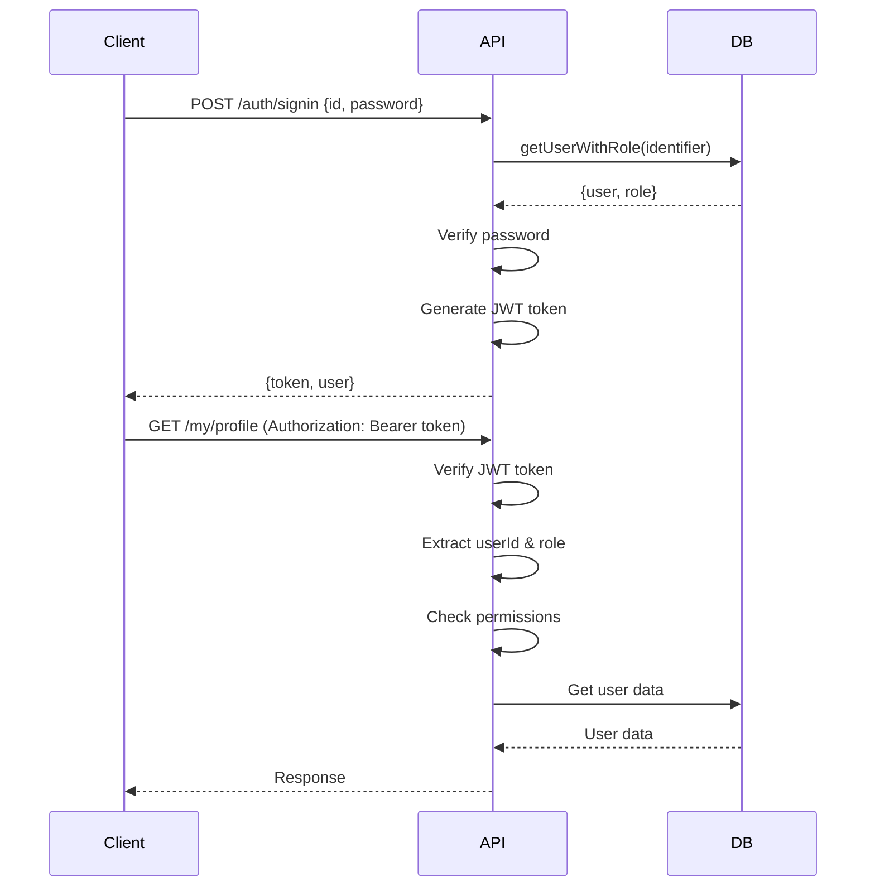

# 🔐 Authentication & Authorization Guide

Complete guide to authentication and authorization in the Resit Exam Management System.

---

## Table of Contents

- [Overview](#overview)
- [Authentication Flow](#authentication-flow)
- [JWT Token Structure](#jwt-token-structure)
- [Authorization](#authorization)
- [API Endpoints](#api-endpoints)
- [Middleware](#middleware)
- [Error Handling](#error-handling)
- [Security Best Practices](#security-best-practices)
- [Examples](#examples)

---

## Overview

The system uses **JWT (JSON Web Tokens)** for stateless authentication with **role-based access control (RBAC)** for authorization.

### Key Features

✅ **Stateless Authentication** - No server-side sessions  
✅ **Role-Based Access Control** - Fine-grained permissions  
✅ **Resource Ownership** - Users can only access their own data  
✅ **Token Expiration** - 24-hour token lifetime  
✅ **Secure Password Handling** - (Recommend bcrypt in production)

---

## Authentication Flow



---

## JWT Token Structure

### Token Payload

```json
{
  "id": "stu-001",
  "role": "student",
  "iat": 1703692800,
  "exp": 1703779200
}
```

| Field | Type | Description |
|-------|------|-------------|
| `id` | string | User's unique identifier |
| `role` | string | User role: `student`, `instructor`, or `secretary` |
| `iat` | number | Issued at (Unix timestamp) |
| `exp` | number | Expiration time (Unix timestamp) |

### Token Lifetime

- **Default**: 24 hours
- **Configurable** in `authHandler.ts`
- **No refresh tokens** (implement if needed)

---

## Authorization

### User Roles

| Role | Description | Access Level |
|------|-------------|--------------|
| **student** | Enrolled students | Own data + public resources |
| **instructor** | Teaching staff | Own data + assigned courses + students in courses |
| **secretary** | Administrative staff | Full system access |

### Authorization Strategies

#### 1. Role-Based Access Control (RBAC)

Restrict routes by user role:

```typescript
// Only students can access
router.get('/my/profile', 
  authMiddleware, 
  requireRole('student'), 
  getMyProfile
);

// Only secretaries can access
router.post('/student', 
  authMiddleware, 
  requireRole('secretary'), 
  createStudent
);

// Multiple roles allowed
router.get('/course/:id', 
  authMiddleware, 
  requireRole('student', 'instructor', 'secretary'), 
  getCourse
);
```

#### 2. Resource Ownership

Users can only access their own resources:

```typescript
// Student can view own data, instructor can view their students, secretary can view all
router.get('/student/:id', 
  authMiddleware, 
  requireOwnerOrRole('secretary', 'instructor'), 
  getStudent
);
```

#### 3. Instructor Course Access

Instructors can only access students enrolled in their courses:

```typescript
// Automatically validated by requireOwnerOrRole for instructors
router.get('/student/:id', 
  authMiddleware, 
  requireOwnerOrRole('secretary', 'instructor'), 
  getStudent
);
```

---

## API Endpoints

### Sign In

Authenticate user and receive JWT token.

**Endpoint:** `POST /auth/signin`

**Request:**
```json
{
  "id": "stu-001",           // Or use "email": "student@edu"
  "password": "password123"
}
```

**Response (200 OK):**
```json
{
  "message": "Sign in successful",
  "token": "eyJhbGciOiJIUzI1NiIsInR5cCI6IkpXVCJ9.eyJpZCI6InN0dS0wMDEiLCJyb2xlIjoic3R1ZGVudCIsImlhdCI6MTcwMzY5MjgwMCwiZXhwIjoxNzAzNzc5MjAwfQ.signature",
  "user": {
    "id": "stu-001",
    "name": "John Doe",
    "email": "john@university.edu",
    "role": "student"
  }
}
```

**Error Responses:**

| Status | Error | Description |
|--------|-------|-------------|
| 400 | Email or ID and password are required | Missing credentials |
| 401 | Invalid credentials | Wrong email/ID or password |
| 500 | Failed to sign in user | Server error |

---

## Middleware

### authMiddleware

Verifies JWT token and attaches user info to request.

**Usage:**
```typescript
router.get('/protected', authMiddleware, handler);
```

**Behavior:**
- Extracts token from `Authorization: Bearer <token>` header
- Verifies token signature and expiration
- Attaches `userId` and `userRole` to request object
- Returns 401 if token is missing or invalid

### requireRole(...roles)

Restricts access to specific roles.

**Usage:**
```typescript
router.post('/student', 
  authMiddleware, 
  requireRole('secretary'), 
  createStudent
);
```

**Parameters:**
- `roles`: One or more allowed roles

**Behavior:**
- Checks if user's role matches allowed roles
- Returns 403 if role doesn't match

### requireOwnResource

Ensures user can only access their own resource.

**Usage:**
```typescript
router.get('/student/:id', 
  authMiddleware, 
  requireOwnResource, 
  getStudent
);
```

**Behavior:**
- Compares `userId` from JWT with `:id` parameter
- Returns 403 if IDs don't match

### requireOwnerOrRole(...roles)

Allows access if user owns resource OR has required role.

**Usage:**
```typescript
router.get('/student/:id', 
  authMiddleware, 
  requireOwnerOrRole('secretary', 'instructor'), 
  getStudent
);
```

**Behavior:**
- Allows if `userId` matches `:id` parameter
- OR allows if user has one of the specified roles
- For instructors, validates course enrollment

### requireInstructorAccess

Validates instructor has access to student (student in instructor's courses).

**Usage:**
```typescript
// Automatically called by requireOwnerOrRole for instructors
```

**Behavior:**
- Gets instructor's courses
- Gets student's courses
- Checks for overlap
- Returns 403 if no common courses

---

## Error Handling

### Authentication Errors

#### 401 Unauthorized

**No Token:**
```json
{
  "error": "No token provided"
}
```

**Invalid Token:**
```json
{
  "error": "Invalid or expired token"
}
```

**No Role in Token:**
```json
{
  "error": "Unauthorized - No role in token"
}
```

### Authorization Errors

#### 403 Forbidden

**Insufficient Permissions:**
```json
{
  "error": "Forbidden - Insufficient permissions",
  "required": ["secretary"],
  "current": "student"
}
```

**Not Owner:**
```json
{
  "error": "Forbidden - You can only access your own resources"
}
```

**Instructor Access Denied:**
```json
{
  "error": "Forbidden - Student is not enrolled in any of your courses"
}
```

---

## Security Best Practices

### Production Recommendations

#### 1. Strong JWT Secret

```env
# ❌ Bad
JWT_SECRET=secret

# ✅ Good
JWT_SECRET=a1b2c3d4e5f6g7h8i9j0k1l2m3n4o5p6q7r8s9t0u1v2w3x4y5z6
```

Generate strong secret:
```bash
node -e "console.log(require('crypto').randomBytes(32).toString('hex'))"
```

#### 2. Password Hashing

**Current:** Plain text passwords ⚠️  
**Recommended:** bcrypt

```typescript
import bcrypt from 'bcrypt';

// Hash password
const hashedPassword = await bcrypt.hash(password, 10);

// Verify password
const isValid = await bcrypt.compare(password, user.password);
```

#### 3. HTTPS Only

Always use HTTPS in production to prevent token interception.

#### 4. Token Expiration

Current: 24 hours  
Consider: Shorter expiration + refresh tokens for sensitive operations

#### 5. Rate Limiting

Implement rate limiting on `/auth/signin` to prevent brute force attacks:

```typescript
import rateLimit from 'express-rate-limit';

const loginLimiter = rateLimit({
  windowMs: 15 * 60 * 1000, // 15 minutes
  max: 5, // 5 requests per window
  message: 'Too many login attempts, please try again later'
});

router.post('/signin', loginLimiter, signInHandler);
```

---

## Examples

### Example 1: Student Sign In and Access Profile

```bash
# 1. Sign in
curl -X POST http://localhost:3000/auth/signin \
  -H "Content-Type: application/json" \
  -d '{
    "id": "stu-001",
    "password": "password123"
  }'

# Response:
# {
#   "token": "eyJhbGciOiJIUzI1NiIsInR5cCI6IkpXVCJ9...",
#   "user": { "id": "stu-001", "role": "student", ... }
# }

# 2. Save token
TOKEN="eyJhbGciOiJIUzI1NiIsInR5cCI6IkpXVCJ9..."

# 3. Access own profile
curl -X GET http://localhost:3000/my/profile \
  -H "Authorization: Bearer $TOKEN"

# 4. Try to access another student's data (will fail with 403)
curl -X GET http://localhost:3000/student/stu-002 \
  -H "Authorization: Bearer $TOKEN"
```

### Example 2: Instructor Access

```bash
# 1. Sign in as instructor
curl -X POST http://localhost:3000/auth/signin \
  -H "Content-Type: application/json" \
  -d '{
    "id": "inst-001",
    "password": "password123"
  }'

# 2. Access student in your course (will succeed)
curl -X GET http://localhost:3000/student/stu-001 \
  -H "Authorization: Bearer $TOKEN"

# 3. Try to create a course (will fail - secretary only)
curl -X POST http://localhost:3000/course \
  -H "Authorization: Bearer $TOKEN" \
  -H "Content-Type: application/json" \
  -d '{"id": "CS999", "name": "Test", "department": "CS"}'
```

### Example 3: Secretary Full Access

```bash
# 1. Sign in as secretary
curl -X POST http://localhost:3000/auth/signin \
  -H "Content-Type: application/json" \
  -d '{
    "id": "sec-001",
    "password": "password123"
  }'

# 2. View all students
curl -X GET http://localhost:3000/secretary/students \
  -H "Authorization: Bearer $TOKEN"

# 3. Create new student
curl -X POST http://localhost:3000/student/ \
  -H "Authorization: Bearer $TOKEN" \
  -H "Content-Type: application/json" \
  -d '{
    "id": "stu-999",
    "name": "New Student",
    "email": "new@edu",
    "password": "pass123"
  }'
```

---

## Authorization Matrix

| Endpoint | Student | Instructor | Secretary |
|----------|---------|------------|-----------|
| `POST /auth/signin` | ✅ | ✅ | ✅ |
| `GET /my/profile` | ✅ Own | ❌ | ❌ |
| `GET /my/instructor/profile` | ❌ | ✅ Own | ❌ |
| `GET /student/:id` | ✅ Own | ✅ Their students | ✅ All |
| `POST /student` | ❌ | ❌ | ✅ |
| `GET /instructor/:id` | ❌ | ✅ Own | ✅ All |
| `POST /instructor` | ❌ | ❌ | ✅ |
| `POST /course` | ❌ | ❌ | ✅ |
| `GET /course/:id` | ✅ | ✅ | ✅ |
| `POST /instructor/r-exam/:id` | ❌ | ✅ | ❌ |
| `GET /secretary/*` | ❌ | ❌ | ✅ |

---

## Troubleshooting

### Common Issues

**Issue:** "No token provided"  
**Solution:** Include `Authorization: Bearer <token>` header

**Issue:** "Invalid or expired token"  
**Solution:** Sign in again to get a new token

**Issue:** "Forbidden - Insufficient permissions"  
**Solution:** Check if your role has access to this endpoint

**Issue:** "Forbidden - You can only access your own resources"  
**Solution:** You're trying to access another user's data

---

**For more information, see:**
- [API Quick Reference](./QUICK_REFERENCE.md)
- [Student API Documentation](./STUDENTS.md)
- [Instructor API Documentation](./INSTRUCTORS.md)
